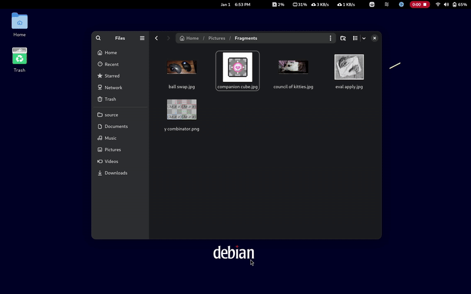
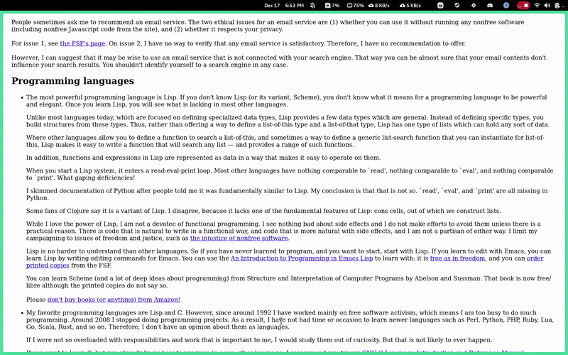
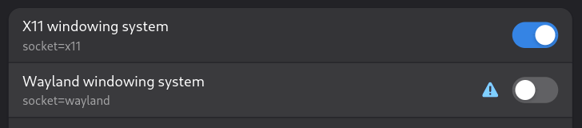

# Tokri

> A desktop basket to drag and drop text, URLs, images, and files.

- Shake while dragging to open the basket and drop items inside.
- Drag items **out** to move them
- Hold **Ctrl** while dragging out to **copy** instead

## Files


## Images


## Text & URLs


## Download
- Linux —  [Flatpak](https://github.com/jarusll/tokri/releases/download/v2025.12.09/Tokri.flatpak)
- Windows — [Portable Zip](https://github.com/jarusll/tokri/releases/download/v2025.12.09/Tokri.zip)

> **Note for Linux users**
>
> This application reads from `/dev/input/*` to detect mouse activation gestures.
> Add your user to the `input` group:
>
> ```bash
> sudo usermod -aG input $USER
> ```
>
> Log out and log back in for the change to take effect.

> **Note for KDE users**
>
> Mouse activation gestures do not work on **native Wayland** (KDE-specific limitation).
>
> Run the app under **XWayland** by disabling Wayland access:
> - Open **Flatseal**
> - Select the app
> - Remove the **Wayland** permission
>
> This forces XWayland and restores gesture support.
>
> 

## Building for Linux

#### Dependencies
- qt6-base

### Build
```bash
cmake -S . -B build -DCMAKE_BUILD_TYPE=Release
cmake --build build
```

## Acknowledgements
- 🎨 Design by [Akshay Majgaonkar](https://www.linkedin.com/in/akshay-majgaonkar/)

## TODO
- Add items from clipboard
- Placeholder text and Image
- Item count
