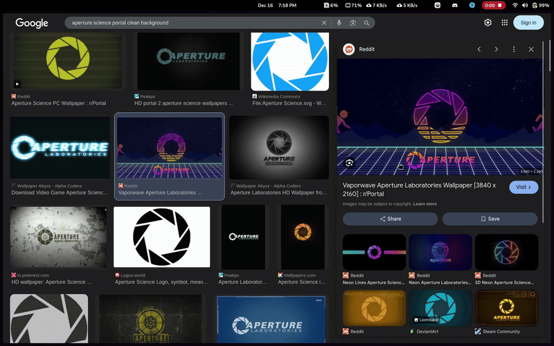

# Tokri



> Tokri is a desktop basket to drop text, images, and files—hold them temporarily and drag them out when needed.

## Download
- Linux —  [Flatpak](https://github.com/jarusll/tokri/releases/download/v2025.12.07/Tokri.flatpak)
- Windows — [Portable Zip](https://github.com/jarusll/tokri/releases/download/v2025.12.07/Tokri.zip)

> **Note for Linux users**
>
> This application reads from `/dev/input/*` to detect mouse activation gestures.
> Add your user to the `input` group:
>
> ```bash
> sudo usermod -aG input $USER
> ```
>
> Log out and log back in for the change to take effect.

> **Note for KDE users**
>
> Run the application under **XWayland**, as mouse activation gestures do not work on native Wayland.


## Building for Linux

#### Dependencies
- qt6-base

### Build
```bash
cmake -S . -B build -DCMAKE_BUILD_TYPE=Release
cmake --build build
```

## Acknowledgements
- 🎨 Design by [Akshay Majgaonkar](https://www.linkedin.com/in/akshay-majgaonkar/)

## TODO
- Spawn near cursor(Impossible on wayland it seems)
- Move mode for drag out
- Offer drag with multiple formats
- Free up gui thread from sending Image
- Add items from clipboard
- Accept clipboard contents
- Search(is this even needed)?
